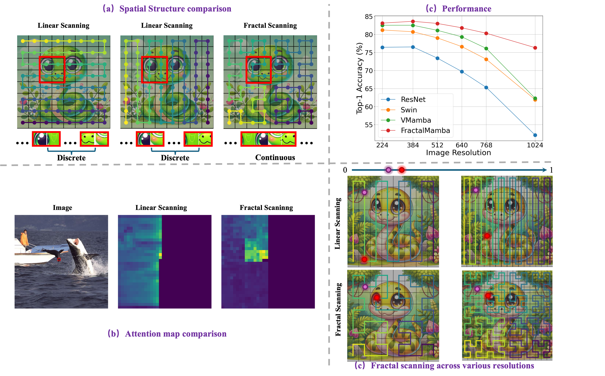

# ❄️ Boosting Vision State Space Model with Fractal Scanning
[Haoke Xiao<sup><span>*</span></sup>](https://github.com/hkxiao), [Lv Tang<sup><span>*, 📧</span></sup>](https://luckybird1994.github.io/), [Peng-Tao Jiang<sup></sup>](https://pengtaojiang.github.io/), [Hao Zhang,<sup><span></span></sup>](https://scholar.google.com.hk/citations?user=DwzGTQsAAAAJ&hl=zh-CN), [Jinwei Chen<sup><span></span></sup>](https://scholar.google.com.hk/citations?hl=zh-CN&user=Pcsml4oAAAAJ) and [Bo Li<sup><span>📧</span></sup>](https://libraboli.github.io/)

<sup><span>*</span></sup> Equal contribution  <sup><span>📧</span></sup> Corresponding author

<sup></sup> vivo Mobile Communication Co., Ltd, Shanghai, China 

<!-- 
<a href='https://arxiv.org/pdf/2406.02395'></a>  -->

## 📖 Abstract
Recently, foundational models have significantly advanced in different tasks, accompanied by Transformer as the general backbone. However, Transformer's quadratic complexity poses challenges for handling longer sequences and higher resolution images, which may limit foundational models further development. To alleviate this issue, various efficient State Space Models (SSMs) like Mamba have emerged, initially matching Transformer performance and gradually surpassing it. To improve the performance of SSMs in computer vision tasks, one crucial viewpoint is effective serialization of images. Existing vision Mambas, which rely on a linear scanning mechanism, often struggle to capture complex spatial relationships in 2D images. This results in feature loss during serialization and negatively impacts model performance. To overcome this limitation, we propose the use of fractal scanning curves for image serialization to enhance the Mambas' ability to accurately model complex spatial dependencies. Additionally, unlike existing vision Mambas, which are designed with various curve scanning directions that increase the complexity, contradicting the original intent of Mamba to enhance model performance. We novelty introduce the Fractal Fusion Pathway (FFP) for our FractalMamba, which can enhance its performance efficiently. Extensive experiments underscore the superiority of our proposed FractalMamba.

## ⚔️ State Space Model with Fractal Scanning
We first revisit the selective state space model and design an fractal scanning algorithm for state space modeling. With this superior algorithm, we develop a Fractal Mamba , which possess excellent spatial structure capture capability and multi-resolution adaptability.

<p align="center">
 
</p>

<!-- 
--- -->
## ⚙️ Environment Setup 

```txt
conda create -n fractal-mamba python=3.9
conda activate fractal-mamba

# Install pytorch 
pip install torch==1.13.1+cu117 torchvision==0.14.1+cu117 torchaudio==0.13.1 --extra-index-url https://download.pytorch.org/whl/cu117

# Install other packages
pip install -r fractal-mamba/requirements.txt 

# Install Vision_Tree_Scanning
cd Fractal Mamba/third-party/TreeScan
pip install -v -e .

```

## 🍺 Model Zoo

<details>
<summary> ImageNet-1k Image Classification </summary>
<br>

<div>

|      name      |   pretrain   | resolution | acc@1 | #param | FLOPs |                                                                             download                                                                              |
| :------------------: | :----------: | :--------: | :---: | :----: | :---: | :---------------------------------------------------------------------------------------------------------------------------------------------------------------: |
| Fractal Mamba-T  | ImageNet-1K  |  224x224   | 83.0  |  30M   |  4.8G   |       [ckpt]() \| [cfg]()       |
| Fractal Mamba-T  | ImageNet-1K  |  384x384   | 83.9  |  30MM   |  8.5G   |       [ckpt]() \| [cfg]()       |
| Fractal Mamba-T  | ImageNet-1K  |  512x512   | 83.0  |  30M   |  15.1G  |       [ckpt]() \| [cfg]()       |
| Fractal Mamba-T  | ImageNet-22K |  640x640   | RUNNING  |  81.8  | 30M  |  [ckpt]() \| [cfg]()  |
| Fractal Mamba-T  | ImageNet-22K |  768x768   | RUNNING  |  80.3  | 30M |  [ckpt]() \| [cfg]()  |
| Fractal Mamba-T  | ImageNet-22K |  1024x1024   | RUNNING  |  76.3  | 30M  |  [ckpt]() \| [cfg]()  |
</div>

</details>

<details>
<summary> COCO Object Detection and Instance Segmentation </summary>
<br>
<div>

|    backbone    |   method   | schedule  | box mAP | mask mAP | #param | FLOPs |                                                                                     download                                                                                      |
| :-------------: | :--------: | :---: | :-----: | :------: | :----: | :---: | :-------------------------------------------------------------------------------------------------------------------------------------------------------------------------------: |
| Fractal Mamba-T  | Mask R-CNN |  1x   |  46.8   |   42.4   |  49M   | 266G  | - \| [cfg]() |
| Fractal Mamba-T  | Mask R-CNN |  3x   |  48.5   |   43.3   |  49M   | 266G  | - \| [cfg]() |

</div>

</details>

<details>
<summary> ADE20K Semantic Segmentation </summary>
<br>
<div>

|    backbone    |   method    | resolution | mIoU (ss/ms) | #param | FLOPs |                                                                                           download                                                                                           |
| :------------: | :---------: | :--------: | :----------: | :----: | :---: | :------------------------------------------------------------------------------------------------------------------------------------------------------------------------------------------: |
| Fractal Mamba-T  |   UperNet   |  512x512   | 48.0 / 48.9  |  53M   | 942G  |  - \| [cfg]()  |
</div>
</details>

<details>
<summary> LEVIR-CD+ Remote Sensing Binary Change Detection </summary>
<br>
<div>

|    backbone    |   method    | resolution | IoU | Precision | Recall | KC | F1 | #param | FLOPs |                                                                                           download                                                                                           |
| :------------------: | :---------: | :--------: | :----------: | :----------: | :----------: | :----------: | :----------: | :----: | :---: | :------------------------------------------------------------------------------------------------------------------------------------------------------------------------------------------: |
| Fractal Mamba-T  |   ChangeMamba   |  1024x1024   | 80.0 | 89.3 | 88.4 | 88.4 | 89.9 | 35M   | 55G  |  - \| [cfg]()  |
</div>
</details>

## 🚀 Train & Evaluate
<details>
<summary> ImageNet-1k Image Classification </summary>
<br>

`bash GrootV/scripts/train.sh`

You need to modify the relevant path to your own.  
</details>


## ⭐️ BibTeX
If you find this work useful for your research, please cite:
```
@article{xiao2024Fractal Mambal,
  title={Fractal MambaL: Tree Topology is All You Need in State Space Model},
  author={Xiao, Yicheng and Song, Lin and Huang, Shaoli and Wang, Jiangshan and Song, Siyu and Ge, Yixiao and Li, Xiu and Shan, Ying},
  journal={arXiv preprint arXiv:2406.02395},
  year={2024}
}
```

## ❤️ Acknowledgement
Code in this repository is built upon several public repositories. Thanks for the wonderful work [GrootVL](https://github.com/EasonXiao-888/MambaTree), [InternImage](https://github.com/OpenGVLab/InternImage/tree/master) and [VMamba](https://github.com/MzeroMiko/VMamba) ! !

<!-- ## ☑️ LICENSE
Our codes are under [MIT](https://opensource.org/license/MIT) license. -->
